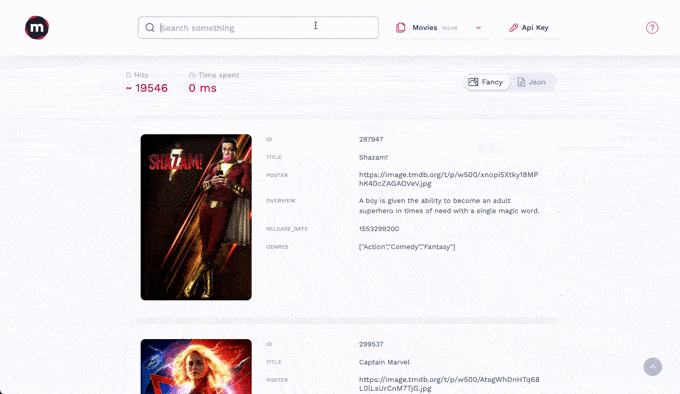
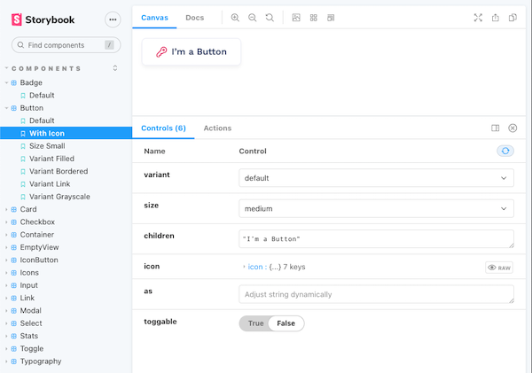

<p align="center">
  
</p>

<h1 align="center">Mini Dashboard</h1>

<h4 align="center">
  <a href="https://github.com/meilisearch/meilisearch">Meilisearch</a> |
  <a href="https://docs.meilisearch.com">Documentation</a> |
  <a href="https://slack.meilisearch.com">Slack</a> |
  <a href="https://www.meilisearch.com">Website</a> |
  <a href="https://docs.meilisearch.com/faq">FAQ</a>
</h4>

<p align="center">
  <a href="https://github.com/prettier/prettier"></a>
  <a href="https://github.com/meilisearch/mini-dashboard/blob/main/LICENCE"></a>
  <a href="https://app.bors.tech/repositories/32634"></a>
</p>
<br/>

<p align="center" style="font-weight:bold;" >Meilisearch's mini-dashboard</p>
<p align="center">PRs and bug issues are welcome, but please do not submit any new feature requests 🙏</p>

<br/>
<p align="center">
  
</p>
<br/>

**Table of Contents**:

- [Setup](#setup)
- [Run](#run)
- [Build](#build)
  - [Generate build](#generate-build)
  - [Specify Meilisearch's server URL](#specify-meilisearchs-server-url)
  - [Run your build](#run-your-build)
- [Storybook](#storybook)
- [Contributing](#contributing)

<br/>

## Setup

```bash
yarn
```

## Run

```bash
yarn start
```

Go to `http://localhost:3000/` and enjoy ! 🎉

## Build

### Generate build

You can generate a build of this project with the following command:

```bash
yarn build
```

### Specify Meilisearch's server URL

⚠️ By default, the application will call Meilisearch at the exact same address as it is running.
Example: if your app is running at `http://localhost:5000`, it will try to call `http://localhost:5000/indexes` to retrieve the list of your indexes.

If you want to specify the URL where your Meilisearch is running, use the `REACT_APP_MEILI_SERVER_ADDRESS` environment variable.

Example:

```bash
REACT_APP_MEILI_SERVER_ADDRESS=http://0.0.0.0:7700 yarn build
```

### Run your build

The above commands will generate an optimized version of the app, inside the `build` folder.

You can then serve it with any web server of your choice.

Example:

```bash
serve build
```

## Storybook

Storybook is a development environment for UI components. It allows you to browse a component library, view the different states of each component, and interactively test components.



```bash
yarn storybook
```

## Contributing

If you want to contribute to this project, please make sure to read [the contributing guidelines](./CONTRIBUTING.md)

## Compatibility with Meilisearch

The current version of the mini-dashboard only guarantees the compatibility with the [version v0.29.1 of Meilisearch](https://github.com/meilisearch/meilisearch/releases/tag/v0.29.1).
